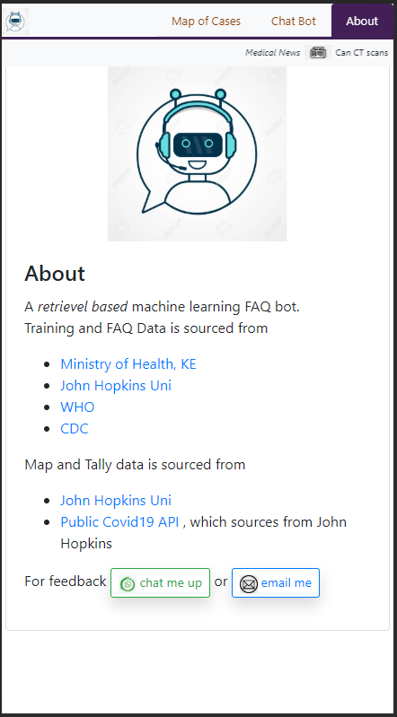

# Retrieval Based Covid19 Bot

    
    
    

**The Data**
- Data Sources: WHO, CDC, JHU, MoH KE

- Pulling data from known disease/pandemic authorities such as CDC and WHO

- Also getting KE national government content. These are static data; knowledge already in place. TODO: a channel for news updates 

- Data is maintained in a Gsheet and can make updates/additions/etc from there

- Clean and classify the above data to have two datasets
    - FAQ_db: This is the knowledge base. One to one mapping of class categories and response paragraphs. Has two main fields: class_category, response_p. Additional fields: src, src_link 
    - Phrases_db: This is the training set on questions/input that users may present to the bot. Has two main fields: input_phrase, class_category 
    
**Approach**
- Retrieval based chat bot. 
- User input gets classified into some category, upon which the appropriate answer is matched
- Using TF-IDF and Cosine Similarity. 

    - Easier to deploy on some cloud services than an MLP NN. 
    - FAQ data seems straightforward enough.
    - This model did well during exploration. Better than an MLP, NaiveBayes and RandomForest. 
    
        - However, possible to do even more exploration and tuning on those models. Played a lot more with the MLP than did with NB or RF
        - Also, don't expect things to remain the same as the learning dataset grows

    - Lemmatizing works better. Number of n-grams doesn't seem to matter as of now. Initially, when training set was so small, removing stop words resulted in poor performance. 

        - MLP seemed to prefer full text (no preprocessing) and single hidden layer with few nodes. Let's see how that changes as the training set grows. 

**Other Things**
- Using the super awesome [JHU map tracker](https://coronavirus.jhu.edu/)
- Saving user input to build up the training set. Intend on updating model periodically with more FAQ content and training phrases from users 

